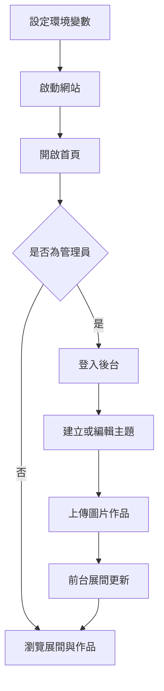
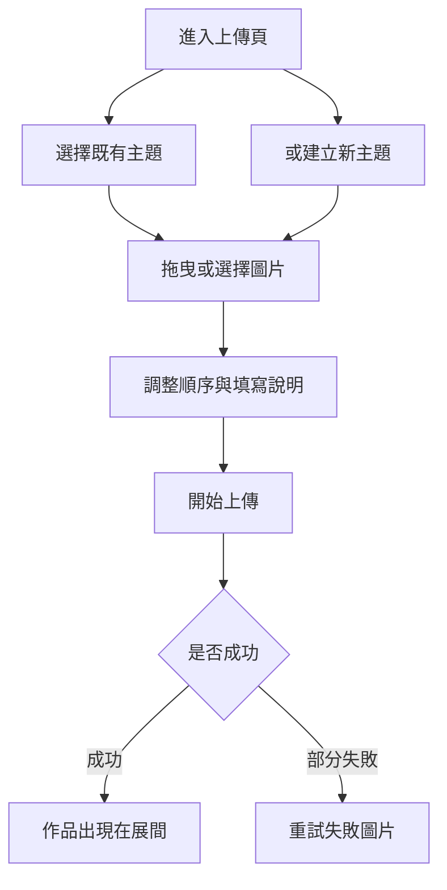
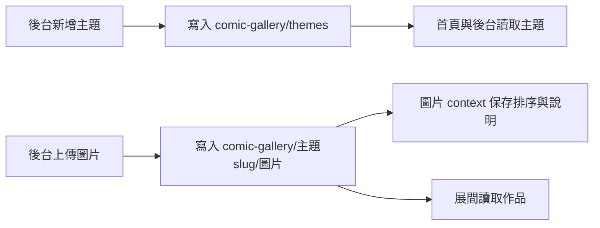

# AI 漫畫藝廊 使用者操作手冊

AI 漫畫藝廊是一個用來展示 AI 漫畫作品的線上展間。訪客可以在首頁瀏覽主題、進入展間閱讀圖片故事；管理員則可以登入後建立主題、上傳圖片、編輯展間資訊與刪除主題。圖片與主題資料儲存在 Cloudinary，本專案本身不使用傳統資料庫。

## 目錄

- [快速開始](#快速開始)
- [整體使用流程](#整體使用流程)
- [公開展間瀏覽](#公開展間瀏覽)
- [管理員登入](#管理員登入)
- [主題管理](#主題管理)
- [上傳作品](#上傳作品)
- [資料保存與 Cloudinary 結構](#資料保存與-cloudinary-結構)
- [部署到 Vercel](#部署到-vercel)
- [離線、隱私與安全](#離線隱私與安全)
- [常見問題](#常見問題)
- [維護者驗證](#維護者驗證)

## 快速開始

### 1. 安裝必要工具

請先準備：

- Node.js 20.9 以上
- npm 10 以上
- 一組 Cloudinary 帳號與 API 憑證

### 2. 安裝專案依賴

```powershell
npm install
```

### 3. 建立本機環境變數

```powershell
Copy-Item .env.example .env.local
```

打開 `.env.local`，填入下列 7 個變數：

```env
ADMIN_USERNAME=admin
ADMIN_PASSWORD_HASH=\$2b\$10\$...
SESSION_SECRET=一段32字元以上的隨機字串
CLOUDINARY_CLOUD_NAME=你的cloud name
CLOUDINARY_API_KEY=你的api key
CLOUDINARY_API_SECRET=你的api secret
NEXT_PUBLIC_CLOUDINARY_CLOUD_NAME=你的cloud name
```

管理員密碼不直接寫進檔案。請先產生 bcrypt hash：

```powershell
node scripts/hash-password.mjs "你的登入密碼"
```

把輸出的 hash 貼到 `ADMIN_PASSWORD_HASH`。如果貼在 `.env.local`，請把每個 `$` 寫成 `\$`，例如：

```env
ADMIN_PASSWORD_HASH=\$2b\$10\$abcd...
```

`SESSION_SECRET` 可以用 PowerShell 產生：

```powershell
[Convert]::ToBase64String((1..32 | % { Get-Random -Maximum 256 }))
```

### 4. 啟動網站

```powershell
npm run dev
```

開啟：

```text
http://localhost:3000
```

常用頁面：

| 路徑 | 用途 |
|---|---|
| `/` | 公開首頁，顯示所有主題展間 |
| `/gallery/<slug>` | 單一主題展間 |
| `/login` | 管理員登入 |
| `/admin` | 主題管理 |
| `/admin/upload` | 上傳作品 |

## 整體使用流程



## 公開展間瀏覽

首頁會顯示所有已建立的主題卡片。每張卡片會呈現：

- 主題標題
- 主題簡介
- 作品頁數
- 封面圖或第一張作品圖

點入主題後會進入 `/gallery/<slug>`。展間中每張作品會依上傳順序排列；如果上傳時有填「說明文字」，會顯示在圖片下方。

在展間中可以：

1. 點擊圖片放大。
2. 在放大檢視中按「上一頁」或「下一頁」切換。
3. 按 `Esc` 或「關閉」離開放大檢視。

## 管理員登入

1. 開啟 `/login`。
2. 輸入 `.env.local` 或部署環境中的 `ADMIN_USERNAME`。
3. 密碼請輸入產生 hash 前的原始明文密碼，不是 `ADMIN_PASSWORD_HASH`。
4. 登入成功後會進入 `/admin`。

登入保護範圍包含：

- `/admin`
- `/admin/upload`
- `/api/themes/*`
- `/api/upload/*`

登入失敗太多次時，系統會暫時限制嘗試，請稍後再試。

## 主題管理

在 `/admin` 可以管理所有展間主題。

### 新增主題

1. 點「新增主題」。
2. 填入主題標題。
3. 可選填 Slug；若留空，系統會依標題自動產生網址用 slug。
4. 可填簡介與展間氛圍色。
5. 點「建立」。

Slug 會出現在網址中，例如：

```text
/gallery/robot-dreams
```

### 編輯主題

每個主題卡片可點「編輯」，可修改：

- 標題
- Slug
- 簡介
- 氛圍色
- 封面圖

封面圖會從該主題已上傳的作品中選擇；若未指定封面，前台會使用第一張作品。

### 刪除主題

點「刪除」會跳出確認。確認後會刪除：

- 主題資料
- Cloudinary 中該主題底下的所有圖片

這是破壞性操作，刪除前請確認不需要保留該主題作品。

## 上傳作品

在 `/admin/upload` 可以把圖片加入指定主題。



### 選擇或建立主題

上傳前必須先選擇主題。也可以在上傳頁直接點「建立新主題」，輸入標題與可選的 Slug。

### 加入圖片

可以使用兩種方式：

- 將圖片拖曳到上傳區
- 點擊上傳區後選擇圖片

支援一次加入多張圖片，也可以重複加入。

### 調整順序與說明

每張圖片加入後可以：

- 按 `↑` 或 `↓` 調整順序
- 填寫說明文字
- 點「移除」從本次上傳清單移除

說明文字可以留空。上傳後，說明文字會儲存在 Cloudinary 圖片的 context metadata。

### 開始上傳

點「開始上傳」後，圖片會透過已登入的 session 取得 server 簽章，再由瀏覽器直傳 Cloudinary。上傳完成後，前台會觸發重新驗證，通常重新整理展間即可看到新作品。

## 資料保存與 Cloudinary 結構

本專案不使用本機資料庫。所有正式資料都在 Cloudinary：



Cloudinary 中的結構大致如下：

```text
comic-gallery/
├── themes                  # raw JSON，保存主題清單
├── robot-dreams/
│   ├── 1712345678901-001   # 圖片
│   └── 1712345678901-002
└── midnight-city/
    └── ...
```

請避免在 Cloudinary Media Library 手動刪除 `comic-gallery/themes`。如果這個 raw 檔被刪除，前台主題清單會消失，即使圖片本身仍可能存在。

## 部署到 Vercel

1. 將專案推送到 GitHub、GitLab 或 Bitbucket。
2. 到 Vercel 新增專案並匯入此 repository。
3. Framework Preset 選 Next.js。
4. 在 Project Settings 的 Environment Variables 加入：

```text
ADMIN_USERNAME
ADMIN_PASSWORD_HASH
SESSION_SECRET
CLOUDINARY_CLOUD_NAME
CLOUDINARY_API_KEY
CLOUDINARY_API_SECRET
NEXT_PUBLIC_CLOUDINARY_CLOUD_NAME
```

5. 部署完成後開啟正式網址。
6. 到 `/login` 登入後台，建立主題並上傳一張測試圖片。

修改任何環境變數後，請在 Vercel 重新 Redeploy。尤其 `NEXT_PUBLIC_CLOUDINARY_CLOUD_NAME` 是會打包到瀏覽器端的變數，改完必須重新建置。

## 離線、隱私與安全

- 網站需要網路才能讀寫 Cloudinary 圖片與主題資料。
- `.env.local` 內含管理員 hash、Session Secret 與 Cloudinary Secret，請勿提交到 Git。
- `CLOUDINARY_API_SECRET` 等同雲端媒體庫的管理鑰匙，請只放在伺服器端環境變數。
- 圖片前台讀取使用公開 Cloudinary URL；不適合存放不能公開的私人圖片。
- 上傳流程是 signed upload，必須先登入後台才能取得簽章。
- 管理員密碼以 bcrypt hash 驗證，登入時輸入明文密碼。

## 常見問題

### 登入一直顯示帳號或密碼不正確

請檢查：

1. `ADMIN_USERNAME` 是否與登入帳號相同。
2. `ADMIN_PASSWORD_HASH` 是否由 `node scripts/hash-password.mjs "你的密碼"` 產生。
3. `.env.local` 裡的 `$` 是否已寫成 `\$`。
4. 修改 `.env.local` 後是否已重新啟動 `npm run dev`。

### 首頁沒有任何主題

若是新站，這是正常狀態。請登入 `/admin` 建立第一個主題。若原本有主題但突然消失，請確認 Cloudinary 的 `comic-gallery/themes` raw 檔是否存在。

### 上傳成功但展間沒有看到圖片

請依序檢查：

1. Cloudinary Media Library 是否有 `comic-gallery/<slug>/` 底下的圖片。
2. 前台網址是否為正確 slug，例如 `/gallery/ok`。
3. `NEXT_PUBLIC_CLOUDINARY_CLOUD_NAME` 是否與 `CLOUDINARY_CLOUD_NAME` 相同。
4. 修改環境變數後是否已重新啟動或重新部署。

### 上傳卡住或失敗

常見原因是 Cloudinary API 設定錯誤。請確認：

- `CLOUDINARY_CLOUD_NAME`
- `CLOUDINARY_API_KEY`
- `CLOUDINARY_API_SECRET`

三者都來自同一個 Cloudinary Product Environment。

### 刪除主題後可以復原嗎

系統刪除主題時會同時要求 Cloudinary 刪除該主題底下的圖片。若沒有另外備份，通常無法從本站復原。刪除前請先確認不需要保留。

## 維護者驗證

更新或部署前可執行：

```powershell
npm run lint
npm run build
```

若要快速確認密碼 hash 是否對得上，可以用正式登入頁測試：

```text
http://localhost:3000/login
```

更完整的 Cloudinary 申請與設定說明請看 [docs/cloudinary-setup.md](docs/cloudinary-setup.md)。部署細節請看 [docs/setup-and-deploy.md](docs/setup-and-deploy.md) 與 [docs/vercel-deployment-guide.md](docs/vercel-deployment-guide.md)。
